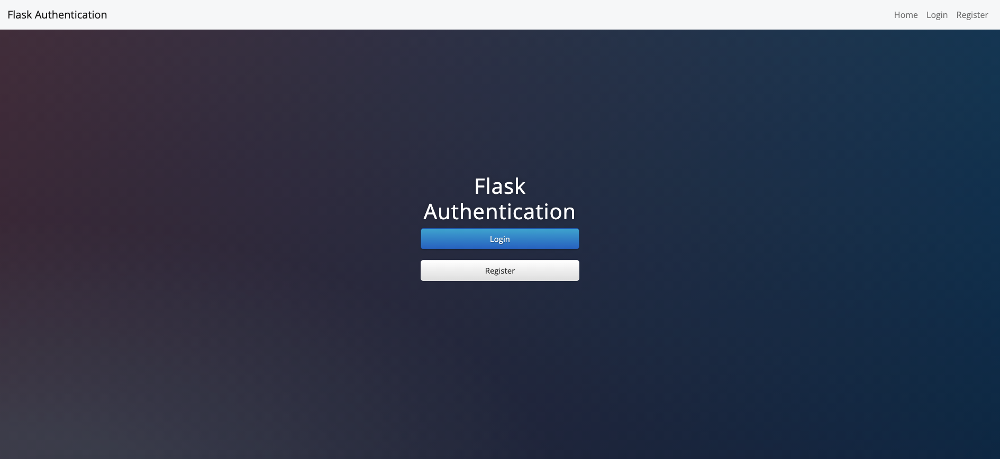
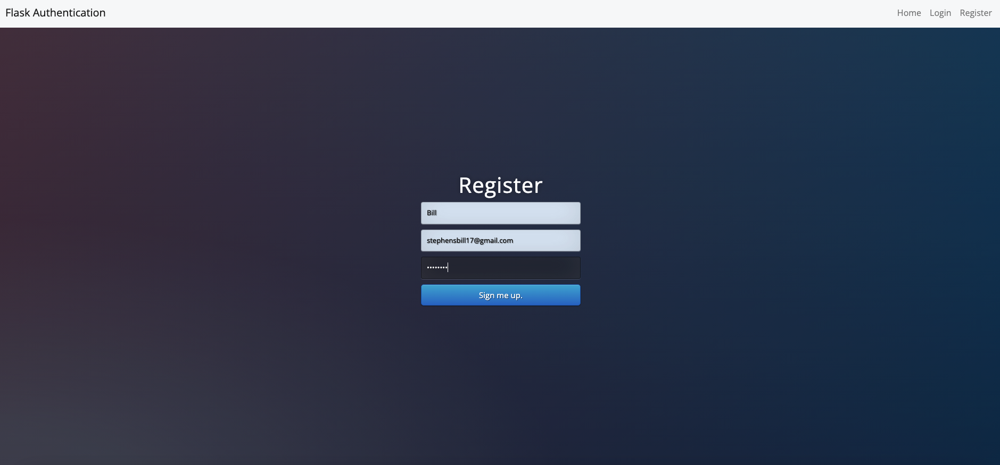
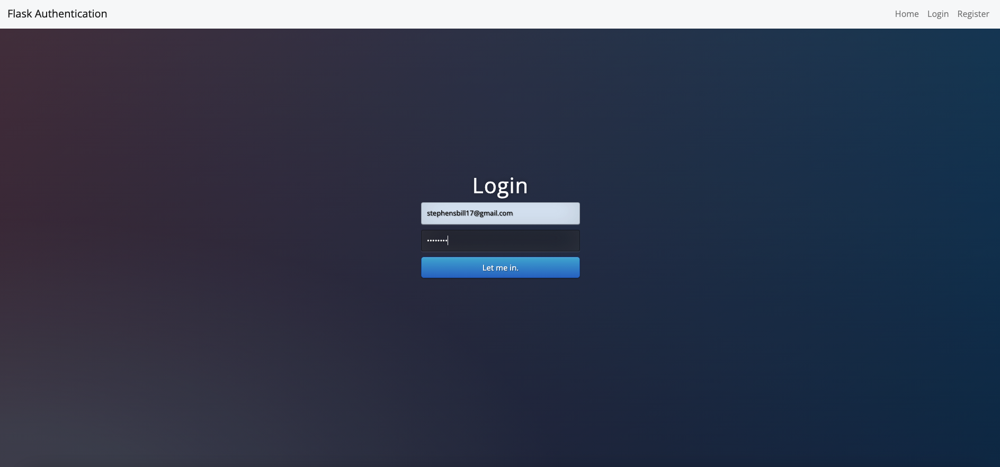
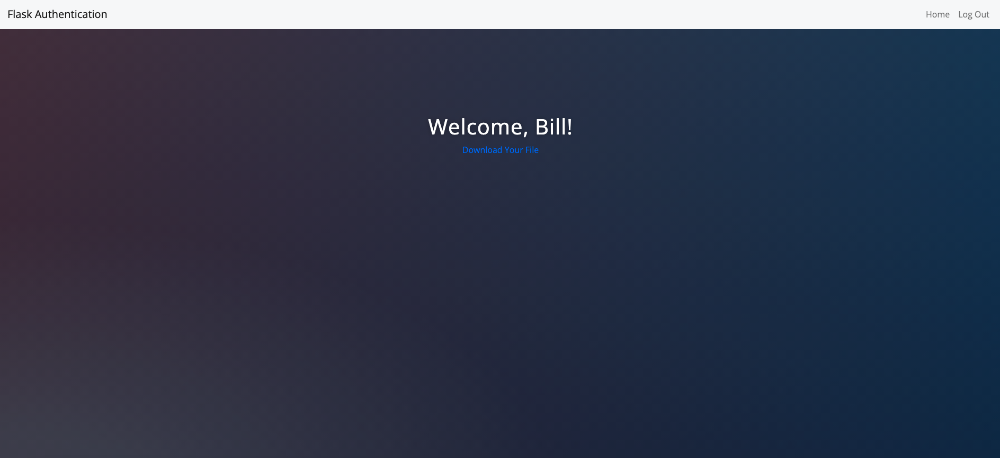
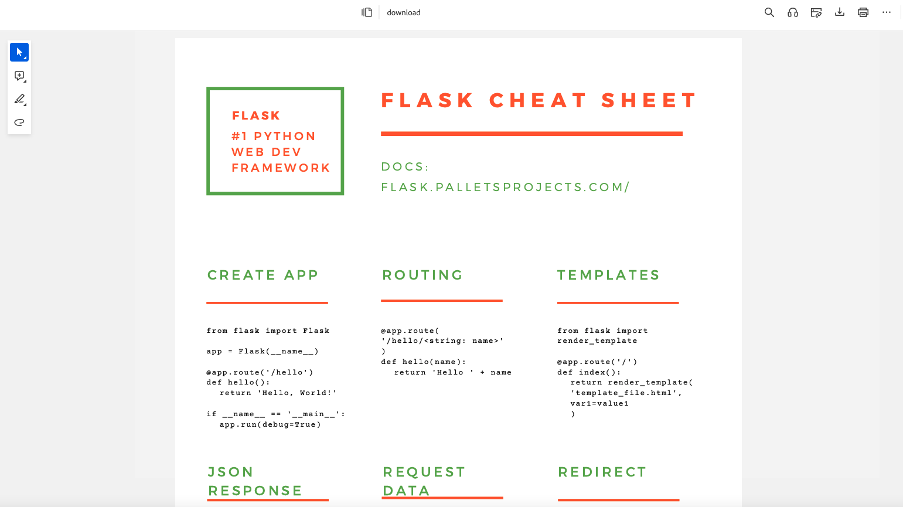

# Python-Flask-Authentication 

  ## Description

  This is an app that allows users to register/login and download a file once logged in.  This app 
  was built using the Python Flask framework, SQLite to store users in a database, and flask_login 
  to authenticate users.  The app also utilizes flash messages to display error messages to user 
  for authentication errors.

  Screenshots below:

  
  ## Table of Contents
  
  - [Installation](#installation)
  - [Usage](#usage)
  - [License](#license)
  - [Contributing](#contributing)
  - [Tests](#tests)
  - [Questions](#questions)
  
  ## Installation
  
  run main.py from command line in terminal
  
  ## Usage
  
  register as a new user and login. Upon login, user can download a pdf file.

  ## License
This application is covered under the MIT License.
 For more information: https://opensource.org/licenses/MIT
  
  ## Contributing
  N/A
  
  ## Tests
  N/A

  ## Questions
  Contact Info 
  GitHub user name: BillStephens2022 
  Link to GitHub profile: https://github.com/BillStephens2022 
  Email: stephensbill17@gmail.com
